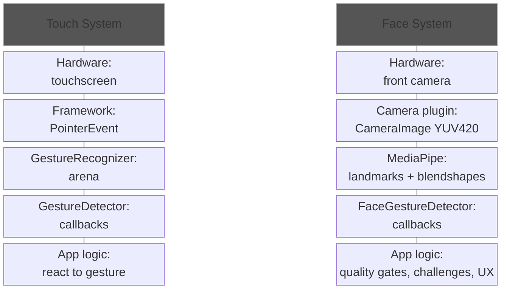
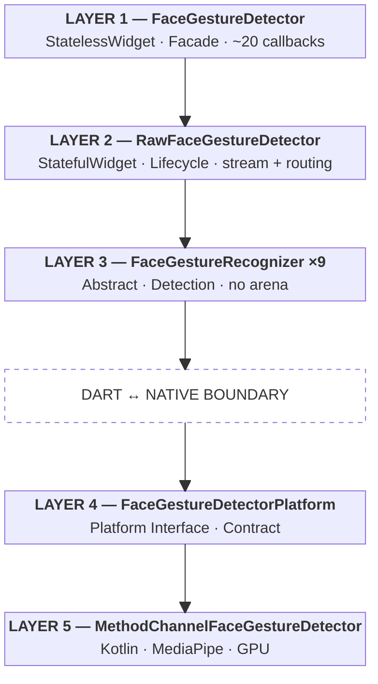
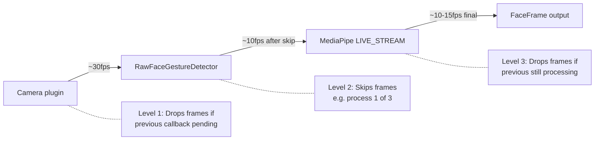
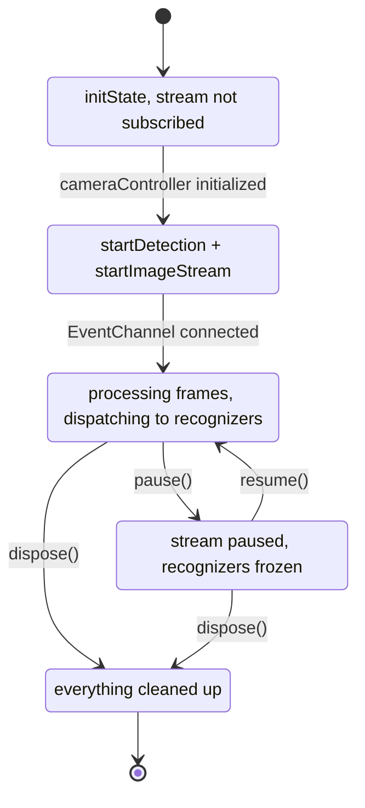
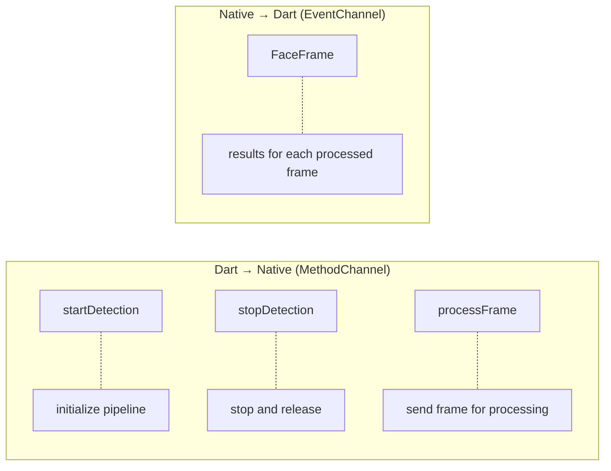
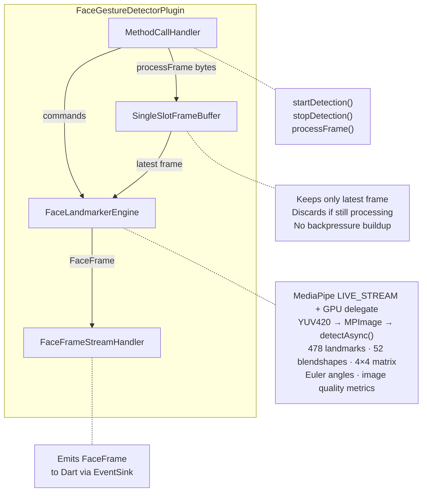
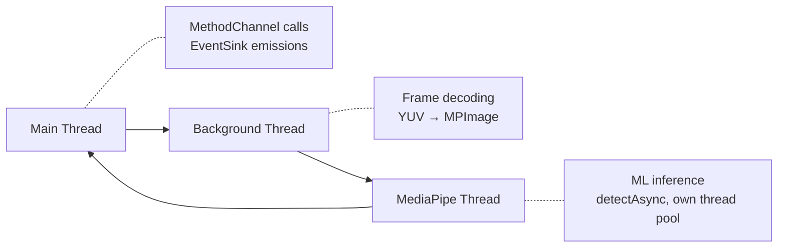

# FaceGestureDetector — Architecture

> A Flutter widget that translates camera data and facial landmarks into **high-level semantic
> callbacks**, exactly as `GestureDetector` translates pointer events into touch gestures.

---

## 1. Guiding Principle

**FaceGestureDetector is a facial intent translator**, not a liveness system.

The analogy that drives every architectural decision:



Direct implications:

| GestureDetector | FaceGestureDetector | Reason |
|-----------------|---------------------|--------|
| Does not create the touchscreen | Does not create the camera | The developer provides the hardware |
| Does not decide what to do with the gesture | Does not decide if the person is real (PAD) | Business decisions belong to the app/server |
| Translates raw events into semantics | Translates landmarks/blendshapes into facial gestures | Both are translators, not decision-makers |
| `null` callback = recognizer not created | `null` callback = recognizer not created | Callbacks-as-subscription: only activate what is needed |

---

## 2. Layered Architecture

The architecture replicates GestureDetector's three-layer hierarchy, plus a native layer:



---

## 3. Data Flow

### 3.1 End-to-end flow of a single frame

```mermaid
sequenceDiagram
    participant Dev as Developer Code
    participant L1 as Layer 1: Facade
    participant L2 as Layer 2: Lifecycle
    participant L45 as Layer 4/5: Native
    participant L3 as Layer 3: Recognizers

    Dev->>L1: CameraController + callbacks
    L1->>L2: recognizer map
    L2->>L45: startDetection()

    rect rgb(80, 80, 80)
        note over Dev,L3: Per frame
        L2->>L2: CameraImage from imageStream
        L2->>L45: processFrame(YUV420 bytes)
        L45->>L45: MediaPipe detectAsync()
        L45-->>L2: FaceFrame via EventChannel
        L2->>L3: addFaceFrame() to each active recognizer
        L3-->>Dev: callback(Details)
    end
```



### 3.2 Processing split

| Phase | Where | What it does | Cost | Data |
|-------|-------|-------------|------|------|
| **Heavy** | Native (Kotlin + GPU) | Frame → landmarks + blendshapes + matrix | 10-30ms per frame | In: ~1.4MB (YUV420). Out: ~2KB |
| **Light** | Dart | FaceFrame → recognize gestures → callbacks | <1ms per frame | In: ~2KB. Out: callbacks |

Heavy processing (ML inference) runs where dedicated hardware exists (native GPU). Light processing (gesture recognition logic) runs in Dart, where it is easy to test, extend, and compose.

### 3.3 Frame dropping — deliberate design at three levels



All three levels complement each other. The result: approximately 10-15 processed frames per second — more than enough for facial gestures (which are slow movements compared to touch gestures).

---

## 4. Layer 1 — FaceGestureDetector (Public Widget)

### 4.1 Identity

`FaceGestureDetector` is a `StatelessWidget` acting as a **facade**. Its only responsibility is translating the developer's declarative configuration (callbacks) into a recognizer map, and delegating it to `RawFaceGestureDetector`. It is the exact equivalent of `GestureDetector`.

### 4.2 Callback API

Callbacks are grouped by **semantic family**, each with an associated `Details` object. A `null` callback means its corresponding recognizer is not instantiated (callbacks-as-subscription pattern).

```dart
class FaceGestureDetector extends StatelessWidget {

  // ── Required ────────────────────────────────────────

  /// Camera controller that provides the image stream.
  final CameraController cameraController;

  // ── Family: Presence ────────────────────────────────

  /// Fires when a face is detected in the frame.
  final ValueChanged<FaceDetectedDetails>? onFaceDetected;

  /// Fires when the face is lost (out of frame, obstructed, or confidence < threshold).
  final VoidCallback? onFaceLost;

  // ── Family: Quality ─────────────────────────────────

  /// Fires when frame quality metrics change (brightness, sharpness, pose).
  final ValueChanged<QualityDetails>? onQualityChanged;

  /// Fires when the distance category changes (tooFar, tooClose, optimal).
  final ValueChanged<DistanceDetails>? onDistanceChanged;

  // ── Family: Pose ────────────────────────────────────

  /// Fires when head pose angles change.
  final ValueChanged<PoseDetails>? onPoseChanged;

  // ── Family: Eyes ────────────────────────────────────

  /// Fires when a complete blink is detected (open → closed → open).
  final ValueChanged<BlinkDetails>? onBlinkDetected;

  // ── Family: Mouth ───────────────────────────────────

  /// Fires when a smile is detected (smile blendshapes > threshold sustained).
  final ValueChanged<SmileDetails>? onSmileDetected;

  /// Fires when an open mouth is detected (jawOpen > threshold sustained).
  final ValueChanged<MouthDetails>? onMouthOpened;

  // ── Family: Brows ───────────────────────────────────

  /// Fires when raised eyebrows are detected (browInnerUp > threshold).
  final ValueChanged<BrowDetails>? onBrowRaised;

  // ── Family: Head Turn ───────────────────────────────

  /// Fires when the head turns left beyond the threshold (yaw > threshold).
  final ValueChanged<HeadTurnDetails>? onHeadTurnLeft;

  /// Fires when the head turns right beyond the threshold (yaw < -threshold).
  final ValueChanged<HeadTurnDetails>? onHeadTurnRight;

  // ── Family: Head Nod ────────────────────────────────

  /// Fires when the head nods up (pitch > threshold).
  final ValueChanged<HeadNodDetails>? onHeadNodUp;

  /// Fires when the head nods down (pitch < -threshold).
  final ValueChanged<HeadNodDetails>? onHeadNodDown;

  // ── Raw Data ────────────────────────────────────────

  /// Fires with every processed FaceFrame. For custom processing outside the plugin.
  final ValueChanged<FaceFrame>? onFaceFrame;

  // ── Configuration ───────────────────────────────────

  /// Threshold and behavior configuration.
  final FaceGestureConfiguration configuration;

  // ── Imperative Control ──────────────────────────────

  /// Controller to pause, resume, and reset.
  final FaceGestureDetectorController? controller;

  // ── Composition ─────────────────────────────────────

  /// Child widget (typically the CameraPreview).
  final Widget? child;
}
```

### 4.3 Callback-to-recognizer translation (build)

```dart
@override
Widget build(BuildContext context) {
  final recognizers = <Type, FaceGestureRecognizerFactory>{};

  // Null callback = recognizer not instantiated (zero cost)
  if (onFaceDetected != null || onFaceLost != null) {
    recognizers[FacePresenceRecognizer] = FacePresenceRecognizerFactory(
      onFaceDetected: onFaceDetected,
      onFaceLost: onFaceLost,
    );
  }

  if (onBlinkDetected != null) {
    recognizers[BlinkRecognizer] = BlinkRecognizerFactory(
      onBlink: onBlinkDetected,
      blinkThreshold: configuration.blinkThreshold,
    );
  }

  if (onHeadTurnLeft != null || onHeadTurnRight != null) {
    recognizers[HeadTurnRecognizer] = HeadTurnRecognizerFactory(
      onTurnLeft: onHeadTurnLeft,
      onTurnRight: onHeadTurnRight,
      yawThreshold: configuration.headTurnYawThreshold,
      sustainedDuration: configuration.sustainedGestureDuration,
    );
  }

  // ... identical pattern for each family

  return RawFaceGestureDetector(
    cameraController: cameraController,
    recognizers: recognizers,
    controller: controller,
    child: child,
  );
}
```

### 4.4 Developer usage

```dart
// ── Minimal usage (presence detection only) ──
FaceGestureDetector(
  cameraController: _cameraController,
  onFaceDetected: (details) => setState(() => _hasFace = true),
  onFaceLost: () => setState(() => _hasFace = false),
  child: CameraPreview(controller: _cameraController),
)

// ── Full liveness flow with challenges ──
FaceGestureDetector(
  cameraController: _cameraController,
  onFaceDetected: (details) => _flowController.onFaceFound(details),
  onFaceLost: () => _flowController.onFaceLost(),
  onQualityChanged: (details) => _flowController.onQualityUpdate(details),
  onDistanceChanged: (details) => _showDistanceFeedback(details),
  onPoseChanged: (details) => _showPoseGuide(details),
  onBlinkDetected: (details) => _flowController.onChallenge('blink', details),
  onHeadTurnLeft: (details) => _flowController.onChallenge('turnLeft', details),
  onHeadTurnRight: (details) => _flowController.onChallenge('turnRight', details),
  onSmileDetected: (details) => _flowController.onChallenge('smile', details),
  configuration: FaceGestureConfiguration(
    headTurnYawThreshold: 25.0,
    sustainedGestureDuration: Duration(milliseconds: 400),
    blinkThreshold: 0.35,
    frameSkipCount: 2,
  ),
  controller: _detectorController,
  child: CameraPreview(controller: _cameraController),
)
```

Complexity is **progressive**: one callback to start, more callbacks as more features are needed. Each additional callback activates only its corresponding recognizer.

---

## 5. Layer 2 — RawFaceGestureDetector (Intermediate Widget)

### 5.1 Identity

`RawFaceGestureDetector` is a `StatefulWidget` that manages the full lifecycle: image stream subscription, native layer communication, recognizer instantiation, and FaceFrame distribution. It is the exact equivalent of `RawGestureDetector`.

### 5.2 Responsibilities

1. **Subscription lifecycle:** `initState` → subscribe to the native EventChannel for face frames. `dispose` → stop detection, cancel subscriptions, destroy recognizers.
2. **Recognizer lifecycle:** When the map changes (rebuild), create new recognizers, destroy removed ones, reuse persisting ones (via `didUpdateWidget`).
3. **FaceFrame distribution:** Each FaceFrame received from the EventChannel is dispatched to **all** active recognizers via `addFaceFrame()`. There is no arena, no competition — all recognizers receive all frames.
4. **Frame dispatch to native:** Subscribes to the CameraController's image stream and sends frames to the native side via `processFrame()`.

### 5.3 Public API (power users)

```dart
class RawFaceGestureDetector extends StatefulWidget {
  /// Controller that provides the image stream.
  final CameraController cameraController;

  /// Map of active recognizers. The key is the recognizer Type.
  /// Each factory knows how to create and configure its recognizer.
  final Map<Type, FaceGestureRecognizerFactory> recognizers;

  /// Controller for imperative control.
  final FaceGestureDetectorController? controller;

  /// Child widget.
  final Widget? child;
}
```

This widget exposes the **recognizer map** directly, enabling advanced developers to:
- Register custom recognizers not available in `FaceGestureDetector`
- Control exactly which recognizers are active
- Create combinations not anticipated by the facade

### 5.4 State pattern



---

## 6. Layer 3 — FaceGestureRecognizer (Detection)

### 6.1 Abstract class

```dart
/// Base class for all facial gesture recognizers.
///
/// Each recognizer receives FaceFrame instances and analyzes them to detect specific gestures.
/// When a gesture is detected, it invokes the corresponding callback with a Details object.
///
/// Analogous to GestureRecognizer — but without GestureArena because facial gestures
/// are concurrent, not competitive.
abstract class FaceGestureRecognizer {
  /// Processes a new face frame. The recognizer accumulates internal state
  /// (previous frames, timestamps, transitions) to detect gestures
  /// that develop over time (e.g. a blink is open→closed→open).
  void addFaceFrame(FaceFrame frame);

  /// Resets internal state. Useful when starting a new challenge.
  void reset();

  /// Releases resources.
  void dispose();
}
```

### 6.2 Why There Is No Arena

In the touch system, the GestureArena resolves ambiguity: a touch that moves — is it a failed tap or the start of a drag? Only one recognizer can win each pointer.

In the face system, **there is no competitive ambiguity**:
- A user can blink AND turn their head simultaneously
- A smile does not compete with a head turn
- Raised eyebrows do not cancel a blink

Each recognizer observes an independent dimension of the face. All work in parallel. They need no arbitration.

**What does exist:** Each recognizer has its own thresholds and temporal logic. A `HeadTurnRecognizer` does not fire `onHeadTurnLeft` on a micro-movement — it requires the yaw angle to exceed a threshold sustained for a minimum period. This logic is internal to the recognizer, not an external arbiter.

### 6.3 Concrete Recognizers

| Recognizer | Input | Core Logic | Callbacks |
|-----------|-------|-----------|-----------|
| **FacePresenceRecognizer** | `isFaceDetected`, `faceConfidence` | Transition absent→present / present→absent | `onFaceDetected(FaceDetectedDetails)`, `onFaceLost()` |
| **QualityGateRecognizer** | `quality`, `faceBoundingBox` | Category changes in quality or distance | `onQualityChanged(QualityDetails)`, `onDistanceChanged(DistanceDetails)` |
| **PoseRecognizer** | `poseAngles` | Angle changes beyond a minimum delta | `onPoseChanged(PoseDetails)` |
| **BlinkRecognizer** | `eyeBlinkLeft`, `eyeBlinkRight` blendshapes | Complete cycle open→closed→open within a time window (~500ms) | `onBlinkDetected(BlinkDetails)` |
| **SmileRecognizer** | `mouthSmileLeft`, `mouthSmileRight` blendshapes | Average > threshold sustained for N ms | `onSmileDetected(SmileDetails)` |
| **HeadTurnRecognizer** | `poseAngles.yaw` | yaw > +threshold sustained → left; yaw < -threshold sustained → right | `onHeadTurnLeft(HeadTurnDetails)`, `onHeadTurnRight(HeadTurnDetails)` |
| **HeadNodRecognizer** | `poseAngles.pitch` | pitch > +threshold sustained → up; pitch < -threshold sustained → down | `onHeadNodUp(HeadNodDetails)`, `onHeadNodDown(HeadNodDetails)` |
| **BrowRecognizer** | `browInnerUp` blendshape | browInnerUp > threshold sustained | `onBrowRaised(BrowDetails)` |
| **RawFrameRecognizer** | Full `FaceFrame` | Passthrough, no transformation | `onFaceFrame(FaceFrame)` |

---

## 7. Layer 4 — Platform Interface (Contract)

### 7.1 Federated Plugin pattern

Follows the Flutter standard for multi-platform plugins. The abstract class defines the contract; each platform implements its own version.

```dart
abstract class FaceGestureDetectorPlatform extends PlatformInterface {

  /// Starts the facial detection pipeline with the given configuration.
  /// On Android: initializes MediaPipe FaceLandmarker with GPU delegate.
  Future<void> startDetection(FaceDetectionOptions options);

  /// Stops the pipeline and releases native resources.
  Future<void> stopDetection();

  /// Sends a camera frame to the native pipeline for processing.
  Future<void> processFrame(FrameData frameData);

  /// Stream of FaceFrame produced by the native pipeline.
  Stream<Map<String, dynamic>> get faceFrameStream;
}
```

### 7.2 Bidirectional communication



---

## 8. Layer 5 — Native Android Implementation (Kotlin)

### 8.1 Components



### 8.2 Threading



The main thread NEVER blocks. `processFrame()` deposits the frame in the `SingleSlotFrameBuffer` and returns immediately. A background coroutine picks it up, decodes it, and feeds MediaPipe. MediaPipe processes asynchronously and its callback emits the result to EventSink from the main thread.

---

## 9. Data Model

### 9.1 FaceFrame — The central type

`FaceFrame` is to the face system what `PointerEvent` is to the touch system: the raw data packet flowing from hardware to recognizers.

```dart
/// Facial data from a camera frame processed by the native pipeline.
///
/// Produced by the native layer at ~10-15fps (after frame dropping).
/// Consumed by FaceGestureRecognizers in Dart.
/// Approximate size: ~2KB per frame (without landmarks), ~10KB with landmarks.
class FaceFrame {
  final Duration timestamp;
  final bool isFaceDetected;
  final double faceConfidence;
  final Rect faceBoundingBox;
  final PoseAngles poseAngles;
  final Map<FaceBlendshape, double> blendshapes;
  final List<FaceLandmark>? landmarks;
  final ImageQualityMetrics quality;
}
```

### 9.2 Support types

```dart
/// Euler angles derived from the 4×4 facial transformation matrix.
class PoseAngles {
  final double pitch;  // Positive = looking up
  final double yaw;    // Positive = turned to user's left
  final double roll;   // Positive = tilted to user's right

  bool get isFrontal => yaw.abs() < 15.0 && pitch.abs() < 15.0;
}

/// Image quality metrics computed on the native side.
class ImageQualityMetrics {
  final double brightness;  // 0.0 = black, 1.0 = white. Optimal: 0.3-0.7
  final double sharpness;   // Laplacian variance. > 100 = acceptable
}

enum DistanceCategory { tooFar, tooClose, optimal }
enum BrightnessCategory { tooDark, tooBright, optimal }
```

### 9.3 Details objects by family

Each callback has its own typed `Details` object, following the pattern of `TapDownDetails`, `DragUpdateDetails`, etc.

| Details Class | Key Fields |
|-------------|-----------|
| `FaceDetectedDetails` | `boundingBox`, `confidence`, `pose`, `distance` |
| `QualityDetails` | `metrics`, `isSufficientForCapture` |
| `DistanceDetails` | `category`, `boundingBoxRatio` |
| `PoseDetails` | `angles`, `isFrontal` |
| `BlinkDetails` | `leftEyeOpenness`, `rightEyeOpenness`, `blinkDuration` |
| `SmileDetails` | `intensity`, `sustainedFor` |
| `MouthDetails` | `openness` |
| `BrowDetails` | `intensity` |
| `HeadTurnDetails` | `yawAngle`, `direction`, `sustainedFor` |
| `HeadNodDetails` | `pitchAngle`, `direction`, `sustainedFor` |

### 9.4 FaceBlendshape enum

The 52 MediaPipe blendshapes (ARKit-compatible), grouped by anatomical region:

| Region | Count | Blendshapes |
|--------|------:|-------------|
| Brow | 6 | `browDownLeft/Right`, `browInnerUp`, `browOuterUpLeft/Right` |
| Cheek | 3 | `cheekPuff`, `cheekSquintLeft/Right` |
| Eye | 14 | `eyeBlinkLeft/Right`, `eyeLookDown/In/Out/UpLeft/Right`, `eyeSquintLeft/Right`, `eyeWideLeft/Right` |
| Jaw | 4 | `jawForward`, `jawLeft`, `jawOpen`, `jawRight` |
| Mouth | 22 | `mouthClose`, `mouthDimple/Frown/LowerDown/Press/Smile/Stretch/UpperUpLeft/Right`, `mouthFunnel/Left/Right/Pucker/RollLower/Upper/ShrugLower/Upper` |
| Nose | 2 | `noseSneerLeft/Right` |
| Neutral | 1 | `neutral` |

---

## 10. Configuration

```dart
/// Threshold and behavior configuration for the detector.
///
/// Default values are calibrated for standard liveness flows
/// based on thresholds documented in the face verification
/// and PAD state-of-the-art research.
class FaceGestureConfiguration {
  // ── Detection ─────────────────────────────────────
  final double faceDetectionConfidence;   // Default: 0.5

  // ── Distance ──────────────────────────────────────
  final double minDistanceRatio;          // Default: 0.20 (< 20% = too far)
  final double maxDistanceRatio;          // Default: 0.60 (> 60% = too close)

  // ── Gesture thresholds ────────────────────────────
  final double headTurnYawThreshold;      // Default: 25.0°
  final double headNodPitchThreshold;     // Default: 20.0°
  final double blinkThreshold;            // Default: 0.35
  final double smileThreshold;            // Default: 0.5
  final double browRaisedThreshold;       // Default: 0.5
  final double mouthOpenThreshold;        // Default: 0.15

  // ── Gesture temporality ───────────────────────────
  final Duration sustainedGestureDuration; // Default: 400ms

  // ── Performance ───────────────────────────────────
  final int frameSkipCount;               // Default: 2 (process 1 out of 3)
  final bool includeLandmarks;            // Default: false
}
```

---

## 11. Quality Gates Mapping

Every quality gate from the PAD state-of-the-art maps to exactly one callback:

| Quality Gate | Data Source | Widget Callback | Details Field |
|-------------|-----------|----------------|--------------|
| Face present | face detection confidence | `onFaceDetected` | `FaceDetectedDetails.confidence` |
| Single face | face count | `onFaceDetected` (validates count=1 internally) | — |
| Brightness | Y channel of frame | `onQualityChanged` | `QualityDetails.metrics.brightness` |
| Sharpness | Laplacian variance | `onQualityChanged` | `QualityDetails.metrics.sharpness` |
| Frontal pose | transformation matrix → yaw, pitch | `onPoseChanged` | `PoseDetails.isFrontal` |
| Distance | bounding box vs frame | `onDistanceChanged` | `DistanceDetails.category` |
| Eyes open | eyeBlink blendshapes | `onBlinkDetected` (inverse) | `BlinkDetails` |
| Mouth closed | jawOpen blendshape | `onMouthOpened` (inverse) | `MouthDetails` |
| Turn left | transformation matrix → yaw > 25° | `onHeadTurnLeft` | `HeadTurnDetails` |
| Turn right | transformation matrix → yaw < -25° | `onHeadTurnRight` | `HeadTurnDetails` |
| Blink | eyeBlink blendshapes (cycle) | `onBlinkDetected` | `BlinkDetails` |
| Smile | mouthSmile blendshapes | `onSmileDetected` | `SmileDetails` |
| Brows up | browInnerUp blendshape | `onBrowRaised` | `BrowDetails` |

---

## 12. Design Principles

### 12.1 Callbacks-as-subscription

> A `null` callback means its recognizer is never created.

A `FaceGestureDetector` with only `onFaceDetected` creates ONE recognizer (FacePresenceRecognizer). No CPU is spent analyzing blinks, smiles, or turns that nobody is listening for.

### 12.2 Declarative facade over imperative machinery

> The public API is declarative (callbacks); the implementation is imperative (state machines, timers, platform channels).

The developer never touches `MethodChannel`, `EventChannel`, `MediaPipe`, `CameraImage`, or `FaceGestureRecognizer` directly (unless they use `RawFaceGestureDetector`).

### 12.3 Details objects as contract

> Every callback has its own typed `Details` object. Raw data or generic maps are never passed.

Details objects are immutable, contain only data relevant to that callback, provide convenience properties (e.g. `isFrontal`, `brightnessCategory`), and allow evolving the API without breaking existing code.

### 12.4 Composition over inheritance

> FaceGestureDetector does not extend CameraController or MediaPipe. It composes them.

The widget receives a CameraController (does not create it), and delegates to MediaPipe via platform interface. Changing the ML engine tomorrow only affects the native layer.

### 12.5 Detection separated from reaction

> FaceGestureDetector detects gestures. The app decides what to do with them.

The plugin does NOT contain liveness flow logic (idle→searching→validating→success). That is the app's responsibility. The plugin only says "the head turned left" — the app decides whether that satisfies the current challenge.

### 12.6 Heavy native, light Dart

> ML inference (frame → landmarks) = native with GPU. Gesture recognition (landmarks → callbacks) = Dart.

This split maximizes performance (GPU for ML) and testability (Dart for business logic). Recognizers can be unit-tested by feeding them synthetic FaceFrames — no device required.

---

## 13. File Structure

```
face_gesture_detector/
│
├── lib/
│   ├── face_gesture_detector.dart              ← Barrel file (exports everything)
│   └── src/
│       ├── widget/
│       │   ├── face_gesture_detector.dart      ← Layer 1: StatelessWidget facade
│       │   └── raw_face_gesture_detector.dart  ← Layer 2: StatefulWidget lifecycle
│       ├── recognizer/
│       │   ├── face_gesture_recognizer.dart    ← Abstract base class
│       │   ├── face_gesture_recognizer_factory.dart
│       │   ├── face_presence_recognizer.dart
│       │   ├── quality_gate_recognizer.dart
│       │   ├── pose_recognizer.dart
│       │   ├── blink_recognizer.dart
│       │   ├── smile_recognizer.dart
│       │   ├── head_turn_recognizer.dart
│       │   ├── head_nod_recognizer.dart
│       │   ├── brow_recognizer.dart
│       │   └── raw_frame_recognizer.dart
│       ├── model/
│       │   ├── face_frame.dart
│       │   ├── pose_angles.dart
│       │   ├── image_quality_metrics.dart
│       │   ├── face_blendshape.dart
│       │   ├── face_landmark.dart
│       │   └── details/
│       │       ├── face_detected_details.dart
│       │       ├── quality_details.dart
│       │       ├── distance_details.dart
│       │       ├── pose_details.dart
│       │       ├── blink_details.dart
│       │       ├── smile_details.dart
│       │       ├── mouth_details.dart
│       │       ├── brow_details.dart
│       │       ├── head_turn_details.dart
│       │       └── head_nod_details.dart
│       ├── configuration/
│       │   └── face_gesture_configuration.dart
│       ├── controller/
│       │   └── face_gesture_detector_controller.dart
│       └── platform/
│           ├── face_gesture_detector_platform_interface.dart
│           ├── method_channel_face_gesture_detector.dart
│           └── face_detection_options.dart
│
├── android/src/main/kotlin/.../
│   ├── FaceGestureDetectorPlugin.kt
│   ├── FaceLandmarkerEngine.kt
│   ├── FaceFrameStreamHandler.kt
│   ├── SingleSlotFrameBuffer.kt
│   ├── FrameDecoder.kt
│   └── EulerAngleCalculator.kt
│
└── test/
    ├── widget/
    │   ├── face_gesture_detector_test.dart
    │   └── raw_face_gesture_detector_test.dart
    ├── recognizer/
    │   ├── face_presence_recognizer_test.dart
    │   ├── blink_recognizer_test.dart
    │   ├── head_turn_recognizer_test.dart
    │   ├── smile_recognizer_test.dart
    │   └── ...
    └── model/
        ├── face_frame_test.dart
        └── pose_angles_test.dart
```

---

## Architectural Decision Records

All key decisions are recorded in [doc/adr/](adr/):

- [ADR-0002](adr/0002-platform-channel-over-native-camera.md) — Platform Channel over native CameraX
- [ADR-0003](adr/0003-no-gesture-arena.md) — No gesture arena for facial gestures
- [ADR-0004](adr/0004-recognizers-in-dart.md) — Gesture recognizers live in Dart
- [ADR-0005](adr/0005-stateless-facade-stateful-lifecycle.md) — StatelessWidget facade, StatefulWidget lifecycle
- [ADR-0006](adr/0006-camera-controller-as-direct-dependency.md) — CameraController as direct dependency
